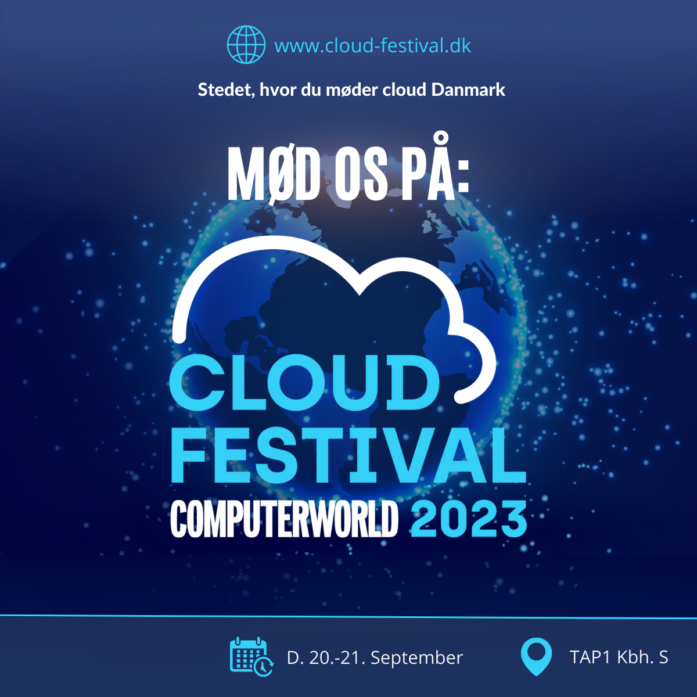

<!-- _backgroundColor: black -->
<!-- _color: white -->
# Cybersecurity <!--fit-->
## Jan Andersen - Tue Hellstern <!--fit-->

---

<!-- _backgroundColor: black -->
<!-- _color: white -->
# Cybersecurity is not just about technology; it's about people, processes, and a culture of proactive vigilance

---

<!-- _backgroundColor: black -->
<!-- _color: white -->

# [kea.officegeek.dk/cybersecurity](https://kea.officegeek.dk/cybersecurity) <!-- fit -->

---

<!-- _backgroundColor: black -->
<!-- _color: white -->
# DATES <!-- fit -->
# AGENDA

---

<!-- _backgroundColor: black -->
<!-- _color: white -->
# GROUPS

- Cloud Festival
    - Groups with Danish speaking
    - Groups with English speaking 
- Exam
    - 4 to 6 students

---

# Morten Wibe <!-- fit -->

---

# IBM Certificeringer

---

# [cloud-festival.dk](https://cloud-festival.dk) <!-- fit -->
- 20-09-2023
- 21-09-2023
# [kea.officegeek.dk/cybersecurity/cloudfair.html](https://kea.officegeek.dk/cybersecurity/cloudfair.html)

---

# Exam
The exam are in groups basede on a written group report, which is to show the ability to combine theory and practice. **We estimate that the total delivery will be typically 4 pages**.

- 15 min presentation per group
- 10 minutes per Student
- **Hand in 22-12-2023 at 12:00**
- 03-01-2024 - Wednesday
- 04-01-2024 - Thursday
- 05-01-2024 - Friday