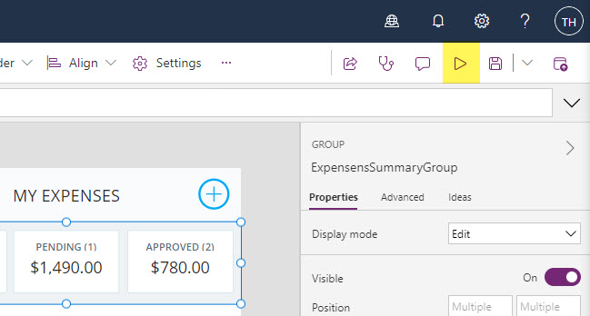

# Agenda
- It Architecture
- 4+1 Model
- ISO/IEC/IEEE 42010
- Design Steps
- Quality Attributes - Non Functions Requirements

<!-- _footer: Tue Hellstern © 2022 -->

---

<!-- _backgroundColor: black -->
<!-- _color: white -->
# Microsoft Power Platform <!-- fit -->

---

<!-- _backgroundColor: black -->
<!-- _color: white -->
# Delivery <!-- fit -->

---

# Power BI
Based on the data you must create a Power BI interactive Dashboard.

The end user of the dashboard are:

- The employees
- The management in the company
- Manageres
- Finance department

It is very important that you have the different end users in mind when you create the dashboard(*s*)

---

# Power Apps
- Create the workflow for the app
- Look at the Microsoft Demo - Expense Report

---

# Expense Report - Demo
- [Open Power Apps](https://make.powerapps.com)
- Click **Create**
- Scroll down to the templet section - Select **My Expenses**
- Give you app a name - *My Expenses App*
- Click **Create**
- **Allow** the connection
- Start the app by clicking the play button
- Create a new expense
- Look at the data on SharePoint

