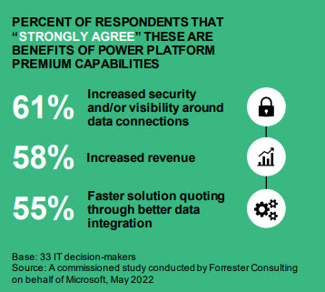

<!-- _backgroundColor: black -->
<!-- _color: white -->
# Microsoft Power Platform <!-- fit -->

---

<!-- _backgroundColor: black -->
<!-- _color: white -->

# Microsoft Power Platform <!-- fit -->
# consists of 5 parts <!-- fit -->

---

- [Power BI](https://powerbi.microsoft.com/)
    - Make informed, confident business decisions by putting data-driven insights into everyone’s hands. 
- [Power Apps](https://powerapps.microsoft.com/)
    - Turn ideas into organizational solutions by enabling everyone to build custom apps that solve business challenges.
- [Power Pages](https://powerpages.microsoft.com/)
    - Quickly build low-code business websites for delivering vital information and services to your customers.
- [Power Automate](https://powerautomate.microsoft.com/)
    - Boost business productivity to get more done by giving everyone the ability to automate organizational processes.
- [Power Virtual Agents](https://powervirtualagents.microsoft.com/)
    - Easily build chatbots to engage conversationally with your customers and employees—no coding required.

---

<!-- _backgroundColor: black -->
<!-- _color: white -->
# DEMO <!-- fit -->

---

# Expense Report - Demo
- [Open Power Apps](https://make.powerapps.com)
- Click **Create**
- Scroll down to the templet section - Select **My Expenses**
- Give you app a name - *My Expenses App*
- Click **Create**
- **Allow** the connection
- Start the app by clicking the play button
- Create a new expense
- Look at the data on SharePoint

---

<!-- _backgroundColor: black -->
<!-- _color: white -->
# Delivery <!-- fit -->

---

# Power BI
Based on the data you must create a Power BI interactive Dashboard.

The end user of the dashboard:

- The employees
- The management in the company
- Manageres
- Finance department

It is very important that you have the different end users in mind when you create the dashboard(*s*)

---

# Power Apps
- Create the workflow for the app - *Diagram*
- Look at the Microsoft Demo - Expense Report
