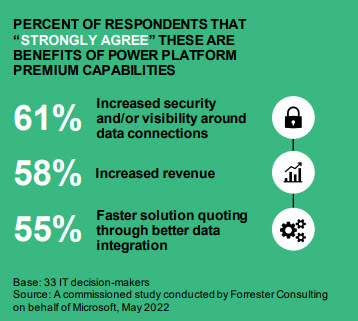

[HOME](../README.md){: .btn .btn-blue }

  

    Table of contents
  

  {: .text-delta }
1. TOC
{:toc}

# Microsoft Power Platform

More than 700 premium connectors to third party ERP, CRM, and other systems of 
record.
• The ability to build and create customer 
connectors across Power Platform that
extend apps, flows, dashboards, virtual 
agents, and websites by calling a publicly
available API or a custom API hosted in a 
cloud provider (such as Azure API 
Management).
• Power Apps model-driven apps.
• Microsoft Dataverse.

The Microsoft Power Platform consists of 5 parts/*programs*

- [Power BI](https://powerbi.microsoft.com/)
    - Make informed, confident business decisions by putting data-driven insights into everyone’s hands. 
- [Power Apps](https://powerapps.microsoft.com/)
    - Turn ideas into organizational solutions by enabling everyone to build custom apps that solve business challenges.
- [Power Pages](https://powerpages.microsoft.com/)
    - Quickly build low-code business websites for delivering vital information and services to your customers.
- [Power Automate](https://powerautomate.microsoft.com/)
    - Boost business productivity to get more done by giving everyone the ability to automate organizational processes.
- [Power Virtual Agents](https://powervirtualagents.microsoft.com/)
    - Easily build chatbots to engage conversationally with your customers and employees—no coding required.

### Premium capabilities include:

- More than 700 premium connectors to third party ERP, CRM, and other systems of record.
- The ability to build and create customer connectors across Power Platform that extend apps, flows, dashboards, virtual  agents, and websites by calling a publicly available API or a custom API hosted in a cloud provider (*such as Azure API Management*)
- Power Apps model-driven apps.
- Microsoft Dataverse (*Database*)

# Forrester Study
Forrester have made a study on the Microsoft Power Platform - **The Total Economic Impact of Microsoft Power Platform Premium Capabilities**

[Read the report - The Total Economic Impact of Microsoft Power Platform Premium Capabilities](./Forrester_The_Total-Economic-Impact.pdf)

# Links
- [powerplatform.microsoft.com/en-us](https://powerplatform.microsoft.com/en-us/)
- [Power BI](https://powerbi.microsoft.com/)
- [Power Apps](https://powerapps.microsoft.com/)
- [Power Pages](https://powerpages.microsoft.com/)
- [Power Automate](https://powerautomate.microsoft.com/)
- [Power Virtual Agents](https://powervirtualagents.microsoft.com/)
- [Microsoft Learn Power Platform 1](https://powerplatform.microsoft.com/en-us/what-is-power-platform/)
- [Microsoft Learn Power Platform 2](https://make.powerapps.com/environments/Default-d10c3c6e-c228-4944-8b6a-6067c6afe3c9/learn)