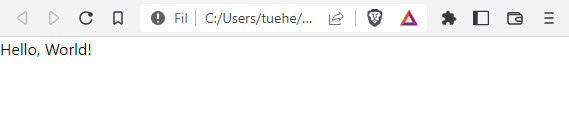

<details open markdown="block">
  <summary>
    Table of contents
  </summary>
  {: .text-delta }
1. TOC
{:toc}
</details>

# PyScript: Python in the Web Browser
PyScript allows you to use Python, with or without JavaScript, to build interactive websites that don’t necessarily have to communicate with a server. 

The main benefit here is that you can leverage your existing knowledge of Python to enter the world of front-end development, lowering the entry barrier and making it more accessible. 

*Be advised that PyScript is very alpha and under heavy development. There are many known issues, from usability to loading times, and you should expect things to change often. We encourage people to play and explore with PyScript, but at this time we do not recommend using it for production.*

# Write Your First “Hello, World” in PyScript
The quickest way to get started with PyScript is by creating a minimal HTML5 document, saving it in a local file such as hello.html, and leveraging the two required files hosted on PyScript’s home page:

```html
<!DOCTYPE html>
<html lang="en">
<head>
  <meta charset="utf-8">
  <meta name="viewport" content="width=device-width, initial-scale=1">
  <title>Hello, World!</title>
  <link rel="stylesheet" href="https://pyscript.net/alpha/pyscript.css" />
  <script defer src="https://pyscript.net/alpha/pyscript.js"></script>
</head>
<body>
  <py-script>print("Hello, World!")</py-script>
</body>
</html>
```

The first file, **pyscript.css**, provides default styling for PyScript’s visual components that you’ll explore later, as well as the loader splash screen. 

The second file, **pyscript.js**, contains JavaScript that bootstraps the Python runtime and adds custom elements like <py-script>.

The python code are in the <py-script> element:

```python
<py-script>print("Hello, World!")</py-script>
```

With this setup, you don’t need to start a web server to access your HTML content. 

Save the HTML document to a local file, and open it directly in your web browser:



You’ve just made your first PyScript application, which will work on any modern web browser, without the need for installing a Python interpreter.

{: .note }
PyScript was only tested on Google Chrome. Unfortunately, this means there might be small differences in your code’s behavior across various web browsers, which has never been a thing in traditional Python development.

